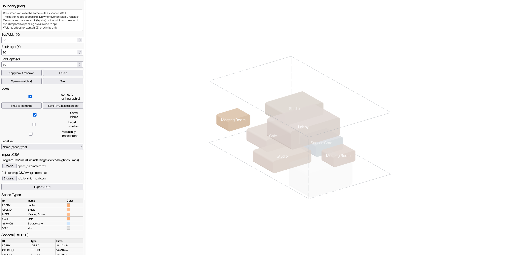
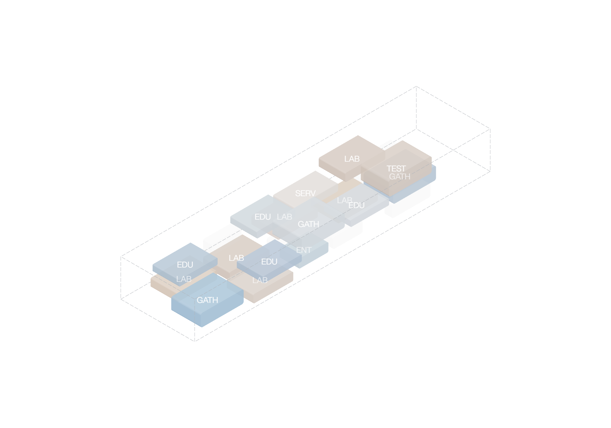

# Architectural Program Creator

Architectural Program Creator is a browser-based spatial planning tool for
turning a list of spaces and their relationships into an interactive 3D program
diagram.

It is designed for early-stage architectural thinking, when the goal is to test
adjacencies, relative sizes, clustering, and overall spatial composition before
moving into detailed modeling.

The app reads:

- a program CSV with space dimensions and metadata
- a relationship matrix CSV with positive and negative adjacency weights

It then places those spaces as 3D blocks inside a configurable boundary,
visualizes them in real time, and exports the arrangement as JSON.

## Screenshots

Full interface view:

3D viewport detail:

## Files

- `program_creator.html`: main application
- `space_parameters.csv`: minimal example program input
- `relationship_matrix.csv`: minimal example relationship matrix

## What It Does

- Loads a program table from CSV
- Loads a relationship matrix from CSV
- Packs and repositions spaces inside a configurable box
- Supports isometric view, labels, and PNG export
- Exports the current 3D arrangement as JSON

## Run Locally

This project does not require a build step.

1. Open `program_creator.html` in a modern browser.
2. If your browser blocks local file features, serve the folder with a simple static server instead.
3. Load `space_parameters.csv` and `relationship_matrix.csv` through the file inputs in the sidebar.

Notes:

- The viewer loads `three.js` from `https://unpkg.com`, so an internet connection is required unless you vendor that dependency locally.
- The HTML references an optional `HelveticaNowDisplay-Regular.ttf` file in the same folder. If it is missing, the app falls back to system fonts.
- The bundled CSVs are intentionally small examples, not a full project dataset.

## Program CSV

The loader accepts flexible column names. Core fields are:

- `code`
- `space_type`
- `family`
- `count`
- `length_m` or `length`
- `depth_m` or `depth`
- `ceiling_height_m`, `height_m`, or `height`

Optional fields:

- `inseparable_group` or similar group identifiers
- preferred position columns such as `preferredx`, `preferredy`, `preferredz`

For rows with `count > 1`, the app generates numbered instances automatically.

## Relationship Matrix CSV

Expected format:

- first column: row type id
- remaining columns: target type ids
- cell values: numeric weights

Interpretation:

- positive values pull space types closer together
- negative values push them apart
- `0` means no relationship

The app normalizes relationship values internally.

## Export

The `Export JSON` button outputs:

- box dimensions
- view settings
- type definitions
- per-space geometry, color, center point, and rotation

## Notes

- This repository currently contains a single-file HTML application.
- If you want fully offline use, download `three.min.js` locally and update the script tag in `program_creator.html`.

## License

This project is source-available for personal, educational, research, and
non-commercial evaluation use only.

Commercial use requires separate permission from the repository owner. See
`LICENSE.txt`.
